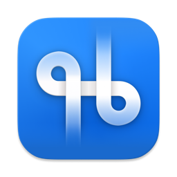

<p align="center">
  
</p>

# Chord

A lightweight macOS menubar app that shows the Karabiner bindings for whatever app you're in — your personal cheat sheet, one click away.

## Overview

Chord lives quietly in your menu bar and answers one question fast: _"What can I press right now?"_

Click the menubar icon and Chord reads the frontmost app, then shows the custom Karabiner shortcuts you've actually defined for it — pulled live from your `karabiner.json` and labelled from each rule's description. Need the full picture? One click opens a complete cheat sheet of every shortcut available for the current app, KeyClu-style.

No dock icon. No window clutter. Open, scan, act, dismiss.

## Features

- **Context-aware bindings** — automatically scoped to the frontmost app, so your muscle-memory shortcuts are never more than a glance away.
- **Live config reading** — pulls your real bindings straight from `karabiner.json`; labels come from each rule's description.
- **Show all shortcuts** — a one-click window listing every keyboard shortcut grouped by app, for when you need the full layer rather than just your custom one.
- **Firefox / Zen cheat sheet** — when Firefox or Zen is frontmost, open a trimmed, catalogue-driven shortcut reference (see `docs/browser-shortcuts.md`).
- **Keyboard Map** — a visual map of occupied and available key combinations from your Karabiner config, with Hyperkey filtering and scope controls.
- **Menubar-first & unobtrusive** — no dock icon, no clutter, native-feeling Swift UI.
- **Re-runnable** — reflects your config changes whenever you update it.

## How it works

1. Chord watches which application is frontmost.
2. On open, it parses your `karabiner.json` and matches rules scoped to that app (plus your global layer).
3. It renders the matching bindings, using each rule's `description` as the human-readable label.
4. The **Show all shortcuts** button surfaces the complete shortcut set grouped by app.
5. The **Open Keyboard Map** button opens a full keyboard visualizer.

## Keyboard Map

The Keyboard Map window shows which key combinations are occupied or still available in your Karabiner config.

- **Open from the menubar** — click Chord → **Open Keyboard Map**.
- **Modifier layer filter** — None, Command, Option, Control, Shift, or Hyper.
- **Scope filter** — All, Global, or Current app (frontmost).
- **Availability semantics** — "Available" means no parsed Karabiner binding occupies that key under the active filter. This reflects your config, not OS-wide key availability.
- **Layout** — US ANSI keyboard for the first release. ISO/JIS layouts can be added later.
- **Hyperkey** — triggers with command+control+option+shift are recognized and filterable. Caps Lock hyper-layer activators appear as layer keys.
- **Ambiguous bindings** — simultaneous inputs, unsupported conditions, and partial shapes are surfaced as warnings rather than silently dropped.

Config changes refresh the map automatically through the existing file watcher.

## Requirements

- macOS (Apple Silicon or Intel)
- Karabiner-Elements installed and configured
- A `karabiner.json` with rule `description` fields (used as labels)
- Xcode (to build from source only)

## Installation

### Build from source (recommended)

No Gatekeeper prompts when you build locally.

From the repo root:

```bash
mise run chord:build
open dist/Chord.app
```

Or from this directory:

```bash
swift build -c release
./scripts/build.sh
open dist/Chord.app
```

Or open the package in Xcode via **File → Open** and select `Package.swift`, then build and run the **Chord** scheme (⌘R).

Building from source requires Xcode (or the Swift toolchain).

### Install from a release DMG

Pre-built DMGs are published on [GitHub Releases](https://github.com/hyugin/chord/releases). Chord is ad-hoc signed (no Apple Developer account): every release is a new binary hash, so macOS quarantines the download and treats it as an unknown app.

A double-clickable installer script does **not** help here — macOS shows the same “could not verify … free of malware” dialog for any executable you download (`.app` or `.command`). Clear quarantine from Terminal instead (commands you paste are not Gatekeeper-blocked the same way).

1. Download `chord-<version>.dmg` and `chord-<version>.dmg.sha256` from the latest release.
2. Verify the download was not altered:

```bash
shasum -a 256 -c chord-<version>.dmg.sha256
```

You should see `chord-<version>.dmg: OK`. The release notes also list the SHA-256 hash if you prefer to compare manually.

3. Prefer the in-app updater if Chord is already installed: download the DMG into **Downloads**, then choose **Install Update from Downloads…** in the Chord menu. It picks the newest `chord.dmg` / `chord-<version>.dmg`, installs to `/Applications`, clears quarantine, and relaunches (verifies a sibling `.sha256` when present).

4. Or install from Terminal (mounts the DMG, copies to Applications, clears quarantine, launches). From the folder that contains the DMG:

```bash
DMG="chord-<version>.dmg"
hdiutil attach "$DMG" -nobrowse -quiet
cp -R "/Volumes/Chord/Chord.app" /Applications/
xattr -cr /Applications/Chord.app
open /Applications/Chord.app
hdiutil detach "/Volumes/Chord" -quiet
```

Or drag **Chord** to **Applications** from the DMG window, then:

```bash
xattr -cr /Applications/Chord.app && open /Applications/Chord.app
```

The DMG also includes **How to Install.txt** with these steps. Repeat after every new download. Alternatively, use **System Settings → Privacy & Security → Open Anyway** (same re-approval every release).

No Apple Developer account or paid signing is required on your side. Building from source (above) also avoids Gatekeeper prompts.

## Usage

1. Launch Chord — it appears in your menu bar.
2. Switch to any app, then click the Chord icon.
3. See your Karabiner bindings for that app at a glance.
4. Click **Show all shortcuts** for the full cheat sheet, or **Quit** to close.

## Configuration

Chord reads from the standard Karabiner config location:

```
~/.config/karabiner/karabiner.json
```

For the cleanest labels, give each `complex_modifications` rule a clear `description` — that's what Chord displays. App-specific rules (scoped via `frontmost_application_if`) show under the matching app; everything else shows in your global layer.

### Supplemental bindings (non-Karabiner)

For shortcuts that never appear in Karabiner — browser userscripts, app-native chords, etc. — add:

```
~/.config/chord/bindings.json
```

Example (also in [`examples/bindings.json`](examples/bindings.json)):

```json
{
  "bindings": [
    {
      "keys": "⌘⇧L",
      "label": "Notion | Toggle tab lock (launcher)",
      "bundleIdentifier": "app.zen-browser.zen"
    }
  ]
}
```

- `keys` — display form (`⌘⇧L` is fine; Chord inserts the thin space)
- `label` — same style as Karabiner rule descriptions
- `bundleIdentifier` — optional; omit for a global entry

Chord creates `~/.config/chord/` on launch and reloads when the file changes.

## Roadmap

- [ ] Search/filter within the current app's shortcuts
- [ ] Global hotkey to open Chord without reaching for the mouse
- [ ] Pinned/favourite bindings
- [ ] Light/dark theming polish
- [x] Auto-refresh on `karabiner.json` change
- [x] Supplemental bindings via `~/.config/chord/bindings.json`

## Inspiration

Chord is inspired by KeyClu — the same glanceable, context-aware spirit, focused on surfacing your custom Karabiner layer.

## Related

| Project | Role |
|---------|------|
| [Watchtower](https://github.com/hyugin/watchtower) | Sibling macOS menubar app — health checks, background apps, MCP supervision, and logs |

## License

MIT — see `LICENSE`.
